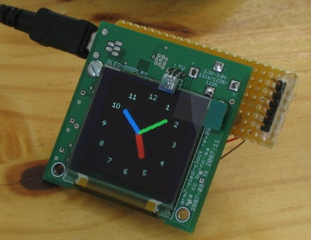
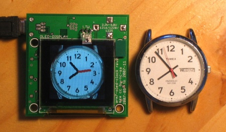

# arm7-oled-clock
hardware & software for an arm7 based analog clock face displayed on an organic led display

This project combines the designs for hardware and the software to make a clock with a graphic organic led display running on an atmel arm7 microcontroller.

Software is written in assembly language and is released under the [GNU GPL v3](http://www.gnu.org/licenses/gpl.html) or greater.

The circuit board is 2"x2" and most components are surface-mount. Hardware design files are licensed under the [creative commons attribution non-commercial share-alike 3.0 license](http://creativecommons.org/licenses/by-nc-sa/3.0/us/).

[Here's the final write-up for the project](files/arm7-oled-clock-project-write-up.pdf
) for those interested in all the design decisions and nitty gritty.

# notes

Automatically exported from code.google.com/p/arm7-oled-clock
